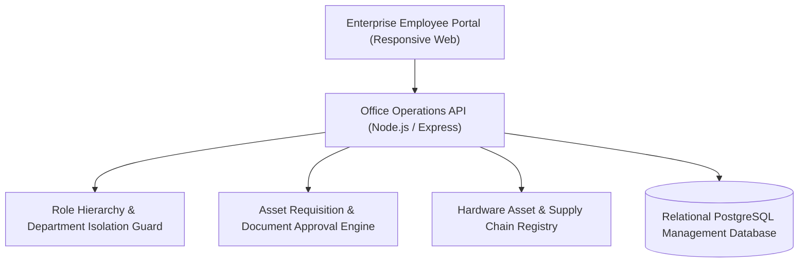
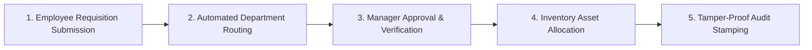

# 📄 TK Office — 100% Offline Android Office & PDF Document Suite
### *Personal Daily-Driver Mobile Productivity Suite: 100% Offline Android Office, PDF Tools & Secure Local Document Engine*

      

  <a href="https://github.com/Tharun4743/TK-Office">📦 <b>Official GitHub Repository</b></a>
  
  

---

## 1. 📌 Problem Statement & Context
Custom-engineered for personal daily-driver productivity, commercial mobile office applications present unacceptable privacy, cost, and reliability barriers for everyday document handling:

* 💸 **Aggressive Paywalls & Subscriptions:** Commercial apps (Adobe Acrobat, Microsoft Office, WPS Office) lock basic personal utilities like PDF merging or page deletion behind recurring monthly subscriptions ($10–$30/mo).
* 📢 **Intrusive Advertisements:** Free mobile office alternatives bombard users with unskippable full-screen video ads and banner trackers that drain battery and data during urgent document tasks.
* 🕵️ **Severe Privacy Invasions:** Commercial document apps mandate cloud account creation, uploading private legal contracts, medical reports, and identity files to remote servers without user consent.
* 💾 **Bloated App Storage Footprint:** Mainstream office suites demand 500MB–1GB of smartphone storage and introduce continuous background telemetry services.

---

## 2. 🔍 Existing Solutions & Critical Gaps
| Mobile Utility | Commercial Office Apps (Adobe / WPS) | Ad-Supported Free Apps | 📄 TK Office Mobile Suite |
| :--- | :---: | :---: | :---: |
| **Subscription Cost** | 💸 Heavy Monthly Paywall ($10–$30) | ⚠️ Hidden In-App Purchases | ✅ 100% Free Personal Utility |
| **Advertisements & Trackers** | ⚠️ Marketing Prompts | ❌ Invasive Full-Screen Ads | ✅ 100% Zero Ads & Zero Tracking |
| **Internet / Cloud Dependency**| ❌ Mandatory Cloud Login | ⚠️ Uploads Data to Cloud | ✅ 100% Offline Local Operation |
| **Privacy & Data Sovereignty** | ⚠️ Third-Party Server Storage | ❌ Data Telemetry Harvested | ✅ Documents Never Leave Device |
| **App Storage Size** | ⚠️ 500MB – 1.2GB Install | ⚠️ 200MB – 400MB | ✅ Lightweight APK Footprint |

### ⚠️ Critical Limitations of Existing Alternatives:
* 🚫 **Document Leakage Risks:** Confidential personal documents and certificates are vulnerable to cloud data breaches when uploaded to third-party mobile apps.
* 🛑 **Internet Dependency:** Commercial apps refuse to open or convert documents when smartphones are offline during travel or in remote zones.
* 📴 **Cluttered Clumsy UIs:** Commercial apps clutter interfaces with marketing banners and cloud upsells, frustrating users who just want to read or merge a PDF.

---

## 3. 💡 Proposed Solution & Architectural Innovation
**TK Office (TK Suite)** is a custom-engineered personal daily-driver, 100% offline, privacy-first mobile productivity suite built with **Flutter and Material 3** for Android devices:

* 🔒 **100% Air-Gapped Local Privacy:** Operates entirely on-device without requesting internet network permissions; user documents never touch external servers.
* 📄 **Complete PDF Tool Suite:** Merge multiple PDFs, split documents by page ranges, rotate pages, add watermarks, and compress file sizes locally.
* 📝 **Rich Mobile Document Editing:** Create, format, and edit rich text documents and export cleanly to standardized PDF and TXT formats.
* 🎨 **Material Design 3 Polish:** Clean, modern interface supporting dynamic light/dark system themes, smooth mobile transitions, and adaptive tablet layouts.
* ⚡ **Ultra-Lightweight Performance:** Tiny APK storage footprint launching in milliseconds with near-zero background battery consumption.

---

## 4. ⚙️ Technical Approach & System Architecture

### 📐 High-Level Architectural Flowchart:

| Mobile Subsystem | Flutter Packages / APIs | Functional Capability |
| :--- | :--- | :--- |
| **Presentation Tier** | Flutter Engine, Material 3, Dart | Adaptive mobile UI, system-aware dynamic theming, smooth list animations |
| **Document Processing** | `pdf`, `printing` packages | On-device PDF page extraction, merging, watermark stamping, and rendering |
| **Storage Sandbox** | Android Scoped Storage API | Enforces strict local document isolation with zero network internet permissions |
| **File Management** | Native Dart I/O, Path Provider | High-efficiency local file caching, directory browsing, and document exports |

### 🔄 End-to-End Operational Lifecycle Workflow:

1. **Document Selection:** User selects local documents or creates a new note → App reads file instantly from Android Scoped Storage.
2. **On-Device Manipulation:** User arranges pages, applies watermarks, or edits text → Pure Dart PDF engine generates output buffer locally.
3. **Instant Export:** Document saved directly to device storage or shared via native Android system share intents without network calls.

---

## 5. 📈 Quantifiable Impact & Measurable Benefits
* 🔒 **100% Privacy & Data Sovereignty:** Absolutely zero network requests; documents never leave the smartphone.
* 💸 **Zero Cost & Ad-Free:** Eliminates expensive mobile document subscriptions and annoying ad interruptions.
* ⚡ **Instant Mobile Utility:** Lightweight APK footprint launching in milliseconds on any Android device.
* 🔋 **Battery Efficient:** Pure client-side execution introduces zero background battery drain.

---

## 6. 🚀 Feasibility, Operational Viability & Scalability
* 🔬 **Technical Feasibility:** Flutter single-codebase architecture allows effortless future compilation for iOS and desktop platforms.
* 💰 **Economic & Financial Viability:** Zero server or hosting costs since 100% of processing happens locally on client smartphones.
* 🏛️ **Operational Governance:** Intuitive Material 3 design requires zero learning curve for everyday smartphone users.
* 📈 **Horizontal Scalability Roadmap:** Modular Flutter architecture readily expands to support offline OCR scanning and spreadsheet table editing.

---

## 7. 👨‍💻 Author & Intellectual Property License

### Lead Architect & Author
**Tharunkumar K** ([@Tharun4743](https://github.com/Tharun4743))
* 🎓 B.Tech Information Technology • V.S.B. Engineering College, Karur
* 🌐 [GitHub Profile](https://github.com/Tharun4743) • [LinkedIn](https://linkedin.com/in/tharunkumark4743) • [Personal Portfolio](https://tharunkumark4743.netlify.app)

### 🔒 Proprietary License Notice (All Rights Reserved)
> [!CAUTION]
> **PROPRIETARY & CONFIDENTIAL INTELLECTUAL PROPERTY**
> 
> All rights reserved. This repository, its architecture, source code, workflows, firmware, and associated documentation are the exclusive intellectual property of **Tharunkumar K**.
> 
> **No entity, organization, or individual is permitted to copy, modify, distribute, publish, commercially exploit, reverse engineer, or deploy any portion of this project without express, prior written permission from the author.**
> 
> **Copyright © 2026 Tharunkumar K. All Rights Reserved.**
