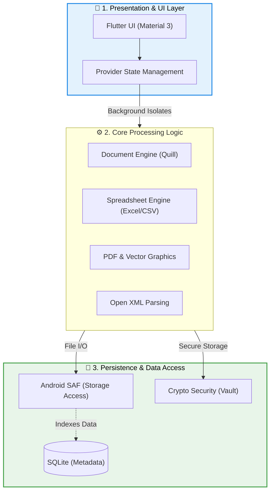

# 🏆 TK Office

<p align="center">
  
  
  
  
  <a href="https://github.com/Tharun4743/TK-Office/releases/latest">
    
  </a>
  <a href="LICENSE">
    
  </a>
</p>

> **"Your Documents. Your Device."**  
> A private, 100% offline Office & PDF Suite built for Android with Flutter, Dart, and Material Design 3.

---

## 🚀 Download & Install

Download the production release APK directly from GitHub Releases:

[-2ea44f?style=for-the-badge&logo=android&logoColor=white)](https://github.com/Tharun4743/TK-Office/releases/download/v1.0.0/app-release.apk)

1. Download **[`app-release.apk`](https://github.com/Tharun4743/TK-Office/releases/download/v1.0.0/app-release.apk)** from Releases.
2. Open the APK on your Android device and tap **Install**.
3. Works completely in **Airplane Mode** — zero internet connection required.

---

## ✨ Core Features

| Feature | Description |
|---|---|
| 📄 **PDF Tools & Editor** | Annotate, add text/signatures, whiteout redact, merge, split, rotate, delete pages, watermark, and encrypt/password-protect PDFs. |
| ✍️ **TK Writer** | Rich text document editor supporting `.docx`, `.txt`, `.rtf`, and `.odt` with full formatting, styles, and export. |
| 📊 **TK Sheets** | Spreadsheet editor for `.xlsx`, `.xls`, and `.csv` featuring formula calculation (`SUM`, `AVERAGE`, `IF`), multi-sheet tabs, and cell formatting. |
| 🖥️ **TK Slides** | Presentation viewer and slide creator for `.pptx` and `.ppt` decks with slide preview and presentation modes. |
| 🔄 **Universal Converter** | 100% offline conversions: `PDF ↔ Images`, `DOCX → PDF`, `XLSX → PDF`, `PPTX → PDF`, `PDF → DOCX`, and `PDF → Text`. |
| 🔒 **Private Vault** | Hardware-backed biometric authentication (Fingerprint / Device PIN) and secure local document storage. |
| 📂 **Smart File Manager** | Automatic document indexing across storage with tagging, favoriting, sorting, search, and batch actions. |

---

## 📂 Supported Formats

Associated with **17+ document formats** in Android's `Open With` intent menu:

- **PDFs**: `.pdf`
- **Documents**: `.docx`, `.doc`, `.txt`, `.rtf`, `.odt`
- **Spreadsheets**: `.xlsx`, `.xls`, `.csv`, `.ods`
- **Presentations**: `.pptx`, `.ppt`, `.odp`
- **Images**: `.png`, `.jpg`, `.jpeg`, `.webp`

---

## 🏗️ System Architecture

TK Office is designed with a highly modular, offline-first architecture, optimizing for extreme performance and memory efficiency on mobile devices.



### 1. Presentation & UI Layer
- **Framework**: Flutter utilizing Material Design 3 guidelines for a premium, native feel.
- **State Management**: **Provider** pattern (`provider`) ensuring decoupled business logic and reactive UI updates.
- **Rendering Engine**: Hardware-accelerated rendering for smooth 60 FPS scrolling through heavy PDFs and large spreadsheets.

### 2. Core Processing Logic
- **Document Engine**: Delta-based rich text processing via `flutter_quill`, enabling seamless `.docx` parsing and editing without data loss.
- **Spreadsheet Computation**: Robust evaluation pipeline (`excel`, `csv`) handling cell formulas, dynamic formatting, and large dataset pagination.
- **PDF & Vector Graphics**: `pdfx` and `syncfusion_flutter_pdf` for high-fidelity rasterization, annotation, and manipulation of complex vector layers.
- **Open XML Parsing**: Direct binary and XML node manipulation (`archive`, `xml`) allowing native reading of Microsoft Office file formats.

### 3. Persistence & Data Access
- **Metadata Indexing**: **SQLite** (`sqflite`) for highly optimized query performance over thousands of local documents (favorites, recent, tags).
- **Storage Access Framework (SAF)**: Deep integration with Android's native file system (`file_picker`, `path_provider`) for secure, scoped I/O operations without requiring broad, invasive storage permissions.
- **Cryptographic Security**: Local encryption algorithms (`crypto`) for the Private Vault, ensuring hardware-backed data protection.

### 4. Concurrency & Performance
- **Isolate Offloading**: All heavy document parsing, exporting, and PDF rendering operations are executed on background **Dart Isolates**, guaranteeing a perpetually responsive UI thread.

---

## 🔒 Privacy & Offline Architecture

- **Zero Cloud Services**: No Firebase, Supabase, or external APIs. All conversions run locally.
- **Zero Internet Requirement**: Zero network permissions in release mode (`INTERNET` permission disabled).
- **Zero Telemetry**: No trackers, ads, or analytics.
- **Dynamic Save-As**: Full control over export destination (`Downloads`, `Documents`, `Pictures`, or custom directory).

---

## 🛠️ Build & Run Locally

### Prerequisites
- **Flutter SDK**: `^3.47.0`
- **Java JDK**: `17+`
- **Android SDK**: `API Level 34+`

### Setup Commands
```bash
# Clone the repository
git clone https://github.com/Tharun4743/TK-Office.git
cd TK-Office

# Get Flutter dependencies
flutter pub get

# Run all offline test suites
flutter test

# Build production release APK
flutter build apk --release
```

---

## 📄 License & Permissions

**Copyright © 2026 Tharun Kumar. All Rights Reserved.**

This project and its source code are proprietary. **No person or entity may copy, reproduce, modify, distribute, publish, or use this code or app without explicit prior written permission from Tharun Kumar.**

For permissions or business inquiries: [tharunkumark42007@gmail.com](mailto:tharunkumark42007@gmail.com)

---

## 👨‍💻 Author & Contact

- **Developer**: Tharun Kumar
- **GitHub**: [@Tharun4743](https://github.com/Tharun4743)
- **Portfolio**: [tharunkumark4743.netlify.app](https://tharunkumark4743.netlify.app/)
- **Email**: [tharunkumark42007@gmail.com](mailto:tharunkumark42007@gmail.com)

---

<p align="center">
  <sub>Developed with ❤️ for complete offline document privacy.</sub>
</p>
